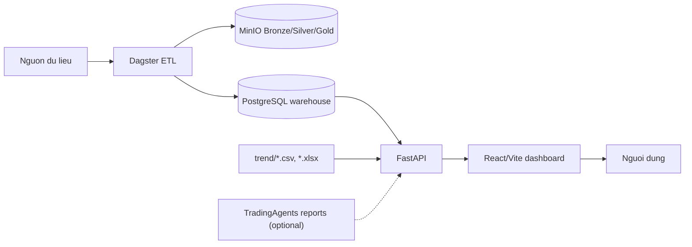

# Kien truc he thong

Project di theo mot workflow tong quat:

## Ranh gioi

- Backend khong crawl va khong xu ly ETL; backend chi doc warehouse va file input da co.
- Frontend chi goi FastAPI, khong biet cau truc MinIO/PostgreSQL.
- TradingAgents la optional report producer, khong nam tren duong bat buoc de web chay.
- Notebook, model local, file parquet/xlsx roi va backup database khong nam trong workflow chinh.

## Web endpoints

| Endpoint | Muc dich |
| --- | --- |
| `GET /api/health` | Kiem tra backend |
| `GET /api/tickers` | Danh sach ma trong warehouse |
| `GET /api/candles` | OHLCV theo ma |
| `GET /api/stock-info` | Ho so co ban |
| `GET /api/financial-dashboard` | BCTC da chuan hoa |
| `GET /api/analysis-reports` | Report Markdown optional |
| `GET /api/trends` | Trend keywords |
| `GET /api/social` | Social ranking |

