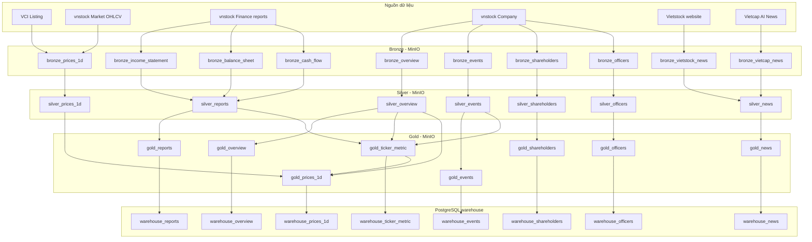

# Luồng ETL hiện tại của `etl_pipeline`

Tài liệu này mô tả đầy đủ luồng ETL đang được khai báo trong `etl_pipeline` tại thời điểm hiện tại. Trọng tâm là cách Dagster assets lấy dữ liệu từ nguồn, ghi xuống MinIO theo các lớp bronze/silver/gold, rồi nạp vào PostgreSQL warehouse để backend/dashboard sử dụng.

Các file chính:

- `etl_pipeline/etl_pipeline/definitions.py`: nơi đăng ký toàn bộ assets và resources.
- `etl_pipeline/config/config.py`: nơi đọc cấu hình MinIO/PostgreSQL từ `.env`.
- `etl_pipeline/etl_pipeline/resources/minio_io_manager.py`: IO manager ghi/đọc parquet trên MinIO.
- `etl_pipeline/etl_pipeline/resources/psql_io_manager.py`: IO manager ghi DataFrame vào PostgreSQL.
- `etl_pipeline/etl_pipeline/assets/`: nơi định nghĩa assets theo tầng bronze/silver/gold/warehouse.
- `etl_pipeline/etl_pipeline/ops/`: nơi chứa logic gọi API/crawl/normalize dùng lại bởi assets.

## 1. Bức tranh tổng quan

Luồng hiện tại đi theo mô hình lakehouse đơn giản:

```text
Nguồn dữ liệu
  -> Bronze trên MinIO
  -> Silver trên MinIO
  -> Gold trên MinIO
  -> Warehouse trên PostgreSQL
  -> FastAPI / dashboard
```

Ý nghĩa từng lớp:

| Lớp | Vai trò |
| --- | --- |
| Bronze | Lưu dữ liệu gần nguồn nhất có thể, kèm metadata crawl/fetch. |
| Silver | Chuẩn hóa schema, lọc universe HOSE, chuẩn hóa đơn vị và cấu trúc dữ liệu. |
| Gold | Tạo dữ liệu đã sẵn sàng phục vụ nghiệp vụ, ví dụ PE/PB, market cap, EPS, BVPS, ROE/ROA/ROS/NIM. |
| Warehouse | Ghi bảng PostgreSQL để backend truy vấn nhanh, có cơ chế chống trùng theo `unique_key` ở một số bảng. |

Lý do tách như vậy:

- Bronze giúp audit nguồn và chạy lại normalize mà không phải crawl lại.
- Silver gom logic làm sạch/chuẩn hóa vào ETL thay vì để API/frontend tự xử lý.
- Gold chứa logic nghiệp vụ nặng hơn, ví dụ metric tài chính và định giá thị trường.
- PostgreSQL phù hợp cho API truy vấn, filter, join, phân trang và vẽ dashboard nhanh hơn đọc parquet trực tiếp.

## 2. Cấu hình và entrypoint Dagster

Dagster load code location từ:

```yaml
load_from:
  - python_module:
      module_name: etl_pipeline.definitions
      location_name: etl_pipeline
```

`definitions.py` đăng ký hai resource:

```python
resources = {
    "minio_io_manager": MinIOIOManager(MINIO_CONFIG),
    "psql_io_manager": PostgreSQLIOManager(PSQL_CONFIG),
}
```

`config/config.py` đọc `.env` theo thứ tự:

1. `etl_pipeline/.env`
2. `.env` ở project root

Các biến chính:

| Biến | Mặc định | Dùng cho |
| --- | --- | --- |
| `MINIO_ENDPOINT` | `localhost:9004` | Endpoint MinIO. |
| `DATALAKE_BUCKET` | `warehouse` | Bucket chứa parquet. |
| `MINIO_ACCESS_KEY` / `MINIO_ROOT_USER` | `minioadmin` | Access key MinIO. |
| `MINIO_SECRET_KEY` / `MINIO_ROOT_PASSWORD` | `minioadmin` | Secret key MinIO. |
| `MINIO_SECURE` | `false` | Bật/tắt HTTPS cho MinIO. |
| `POSTGRES_HOST` | `localhost` | Host PostgreSQL. |
| `POSTGRES_PORT` | `5400` | Port PostgreSQL. |
| `POSTGRES_DB` | `postgres` | Database. |
| `POSTGRES_USER` | `admin` | User. |
| `POSTGRES_PASSWORD` | `change_me` | Password. |

Dagster instance local dùng SQLite metadata và local compute logs theo `dagster_home/dagster.yaml`.

## 3. Cách IO manager đặt tên dữ liệu

### MinIO path

`MinIOIOManager` tự suy ra object path từ `asset_key`.

Quy tắc chính:

- `asset_key.path[0]` là layer, ví dụ `bronze`, `silver`, `gold`.
- Nếu tên asset bắt đầu bằng prefix layer, prefix đó được bỏ khỏi tên file. Ví dụ `bronze_prices_1d` thành `prices_1d`.
- Nếu asset có partition, object path là `<base>/<partition>.parquet`.
- Nếu không partition, object path là `<base>.parquet`.

Ví dụ:

| Asset | MinIO object |
| --- | --- |
| `["bronze", "prices", "bronze_prices_1d"]`, partition `2026-06-27` | `bronze/prices/prices_1d/2026-06-27.parquet` |
| `["silver", "silver_reports"]` | `silver/reports.parquet` |
| `["gold", "company_info", "gold_overview"]` | `gold/company_info/overview.parquet` |
| `["bronze", "bronze_vietstock_news"]`, partition `2026-01-01` | `bronze/vietstock_news/2026-01-01.parquet` |

Lý do làm như vậy: code asset vẫn có tên rõ ràng theo layer (`bronze_*`, `silver_*`) nhưng object path gọn hơn, tránh lặp `bronze/bronze_*`.

### Đọc partition

`MinIOIOManager.load_input` hỗ trợ ba kiểu:

- Partition -> partition: đọc đúng partition hiện tại.
- Unpartitioned asset: đọc file `.parquet` không partition.
- Partitioned -> unpartitioned merge: nếu input metadata có `load_all_partitions=True`, nó đọc tất cả partition và concat lại.

Điểm này rất quan trọng với `silver_reports`: asset này đọc tất cả partition báo cáo tài chính bronze để tạo một bảng fact báo cáo đầy đủ.

### PostgreSQL write

`PostgreSQLIOManager` ghi DataFrame vào PostgreSQL theo:

- `schema = context.asset_key.path[0]`
- `table = context.asset_key.path[-1]`

Ví dụ asset `warehouse_prices_1d` có key prefix `["warehouse"]`, nên ghi vào:

```text
warehouse.warehouse_prices_1d
```

Nếu output metadata có `unique_key`, IO manager sẽ:

1. Drop duplicate trong DataFrame theo `unique_key`, giữ bản cuối.
2. Ghi DataFrame vào temp table.
3. Xóa các record trùng key trong bảng thật.
4. Insert dữ liệu mới từ temp table.
5. Drop temp table.

Đây là kiểu upsert thủ công theo key, giúp chạy lại partition hoặc chạy incremental không tạo duplicate.

Nếu không có `unique_key`, IO manager append bình thường.

## 4. Danh sách asset hiện tại

`definitions.py` đang đăng ký các asset chính sau:

| Nhánh | Bronze | Silver | Gold | Warehouse |
| --- | --- | --- | --- | --- |
| Giá 1D | `bronze_prices_1d` | `silver_prices_1d` | `gold_prices_1d` | `warehouse_prices_1d` |
| Báo cáo tài chính | `bronze_income_statement`, `bronze_balance_sheet`, `bronze_cash_flow` | `silver_reports` | `gold_reports` | `warehouse_reports` |
| Tin tức | `bronze_vietstock_news`, `bronze_vietcap_news` | `silver_news` | `gold_news` | `warehouse_news` |
| Company overview | `bronze_overview` | `silver_overview` | `gold_overview` | `warehouse_overview` |
| Shareholders | `bronze_shareholders` | `silver_shareholders` | `gold_shareholders` | `warehouse_shareholders` |
| Officers | `bronze_officers` | `silver_officers` | `gold_officers` | `warehouse_officers` |
| Events | `bronze_events` | `silver_events` | `gold_events` | `warehouse_events` |
| Ticker metric | Không có bronze riêng | Dùng `silver_reports`, `silver_overview`, `silver_events` | `gold_ticker_metric` | `warehouse_ticker_metric` |

Lưu ý: `bronze_company_subsidiaries` đang được khai báo ở bronze, nhưng hiện không thấy `silver_subsidiaries`, `gold_subsidiaries`, `warehouse_subsidiaries` được đăng ký trong `definitions.py`.

## 5. Universe mã chứng khoán

Universe được lấy trong `ops/tickers.py` bằng `vnstock.Listing(source="VCI")`.

Các hàm chính:

- `get_stock_universe(exchange="HOSE")`: lấy các mã loại STOCK trên sàn HOSE.
- `get_stock_symbols(exchange="HOSE")`: trả list ticker HOSE đã sort.
- `get_stock_master(exchange="HOSE")`: trả master data gồm `ticker`, `name`, `trading_floor`, nhóm VN30/VN100 và ngành/subindustry.

Các chỉ số đặc biệt:

```python
HOSE_INDEX_TICKERS = {"VNINDEX", "VN30", "VN100"}
```

Luồng giá luôn thêm các index này vào universe. Các luồng khác chủ yếu lọc về HOSE stock symbols.

Vì sao làm vậy:

- Dữ liệu dashboard tập trung vào HOSE, tránh kéo quá rộng sang các sàn/loại tài sản khác.
- VNINDEX/VN30/VN100 là index, không phải stock, nhưng cần cho so sánh thị trường và tính PE/PB index.

## 6. Nhánh giá 1D

### 6.1 Bronze: `bronze_prices_1d`

File: `assets/bronze/prices.py`

Partition:

```python
DailyPartitionsDefinition(
    start_date="2020-01-01",
    timezone="Asia/Ho_Chi_Minh",
    end_offset=1,
)
```

Nguồn:

- `vnstock.ui.Market`
- Gọi `mkt.equity(ticker).ohlcv(start, end, interval="1d")`

Logic hiện tại:

1. Lấy danh sách ticker HOSE từ `get_stock_list()`.
2. Thêm `VNINDEX`, `VN30`, `VN100`.
3. Hỏi PostgreSQL ngày lớn nhất đã có trong `warehouse.warehouse_prices_1d` qua `psql_io_manager.get_max_date`.
4. Nếu warehouse chưa có dữ liệu:
   - chạy full load từ `2020-01-01` đến ngày hiện tại theo giờ Việt Nam.
5. Nếu warehouse đã có dữ liệu:
   - chạy incremental từ `last_loaded_date + 1` đến ngày hiện tại.
6. Nếu warehouse đã mới nhất:
   - trả DataFrame rỗng kèm metadata `mode="up_to_date"`.
7. Chuẩn hóa cột `time` thành `date`, lọc trong khoảng cần lấy, giữ các cột:
   - `ticker`
   - `date`
   - `high`
   - `low`
   - `open`
   - `close`
   - `volume`
   - `date_fetched`

Tại sao bronze giá dựa vào ngày lớn nhất trong PostgreSQL thay vì chỉ dựa vào partition MinIO:

- PostgreSQL là nơi backend đọc dữ liệu thật, nên trạng thái load nên bám theo warehouse.
- Nếu MinIO có file nhưng PostgreSQL chưa load đủ, incremental vẫn phải bổ sung theo warehouse.
- Giảm khả năng dashboard thiếu dữ liệu do lệch giữa object storage và database.

### 6.2 Silver: `silver_prices_1d`

Input:

```python
AssetIn(["bronze", "prices", "bronze_prices_1d"])
```

Logic:

1. Chuyển `date` về kiểu date.
2. Giữ cột chuẩn:
   - `ticker`
   - `date`
   - `high`
   - `low`
   - `open`
   - `close`
   - `volume`
3. Lọc ticker thuộc HOSE hoặc index trong `HOSE_INDEX_TICKERS`.

Tại sao cần silver:

- Bronze có thể chứa metadata crawl/fetch và định dạng từ API.
- Silver đưa giá về schema ổn định cho các bước tính toán phía sau.

### 6.3 Gold: `gold_prices_1d`

Input:

- `silver_prices_1d`
- `gold_ticker_metric`
- `silver_overview`

Logic chính:

1. Merge EPS/BVPS từ `gold_ticker_metric`.
2. Với mỗi ngày giao dịch, xác định quý hiện tại rồi lấy metric của quý trước; nếu quý trước thiếu thì fallback quý trước nữa.
3. Merge `trading_floor`, `cap_group`, `issue_share` từ `silver_overview`.
4. Với cổ phiếu thường:
   - `market_cap = close * issue_share / 1_000_000`
   - `pe = close / eps * 1000`
   - `pb = close / bvps * 1000`
5. Với index `VN30`, `VN100`, `VNINDEX`:
   - tính PE/PB tổng hợp từ các cổ phiếu thành phần theo market cap, earnings, equity.
6. Tính các mức biến động:
   - `chg_1d`
   - `chg_1w`
   - `chg_1m`
   - `chg_3m`
   - `chg_6m`
   - `chg_1y`
   - `chg_3y`
7. Khi cần giá quá khứ để tính biến động, asset đọc partition `gold_prices_1d` gần nhất trước đó, fallback tối đa 10 ngày. Cơ chế này giúp xử lý ngày nghỉ/cuối tuần/không có giao dịch.

Tại sao tính PE/PB và change ở Gold:

- Đây là dữ liệu đã phục vụ nghiệp vụ/dashboard, không còn là raw price.
- Tính ở ETL giúp backend đọc nhanh, không phải tính lại cho mỗi request.
- Việc dùng fallback partition giúp chỉ số thay đổi vẫn có nghĩa trên lịch giao dịch không liên tục.

### 6.4 Warehouse: `warehouse_prices_1d`

Output PostgreSQL:

```text
warehouse.warehouse_prices_1d
```

Unique key:

```python
["ticker", "date"]
```

Ý nghĩa: một ticker chỉ có một bản ghi cho mỗi ngày giao dịch. Chạy lại cùng ngày sẽ thay bản cũ thay vì append duplicate.

## 7. Nhánh báo cáo tài chính

### 7.1 Bronze: `bronze_income_statement`, `bronze_balance_sheet`, `bronze_cash_flow`

File: `assets/bronze/reports.py`

Ba asset được tạo từ factory:

```python
bronze_reports("is") -> bronze_income_statement
bronze_reports("bs") -> bronze_balance_sheet
bronze_reports("cf") -> bronze_cash_flow
```

Mapping:

| `report_type` | Asset | Method VCI |
| --- | --- | --- |
| `is` | `bronze_income_statement` | `income_statement` |
| `bs` | `bronze_balance_sheet` | `balance_sheet` |
| `cf` | `bronze_cash_flow` | `cash_flow` |

Partition:

- Static partitions là 21 quý gần nhất.
- Format partition: `YYYY-Qn`.

Nguồn:

- `vnstock.Finance(source="VCI", symbol=ticker, period="quarter", get_all=True)`

Logic full load:

1. Nếu asset chưa có partition nào trên MinIO, chạy full load.
2. Gọi báo cáo cho toàn bộ ticker.
3. Dữ liệu VCI dạng wide được chuyển sang dạng bronze long trong `_to_bronze_long`.
4. Ghi từng quý thành từng partition parquet bằng `io.write_partition`.
5. Partition đang materialize không ghi thêm vì full load đã ghi toàn bộ partition cần thiết.

Logic incremental:

1. Xác định inactive symbols bằng cách nhìn 4 partition gần nhất.
2. Nếu partition hiện tại đã có dữ liệu, lấy danh sách ticker đã có.
3. Chỉ crawl ticker chưa có trong partition và không bị coi là inactive.
4. Lấy report mới, lọc đúng `year`, `quarter` theo partition hiện tại.
5. Merge với dữ liệu cũ trong partition, thay bản của ticker mới lấy.

Tại sao bronze report chuyển wide -> long sớm:

- VCI trả nhiều cột kỳ như `2025-Q1`, `2025-Q2`, ...
- Chuyển sang long giúp partition theo quý và normalize về fact table dễ hơn.
- Vẫn giữ các cột tương thích cũ như `CP`, `Nam`, `Ky` để các bước sau và code cũ không bị gãy.

### 7.2 Silver: `silver_reports`

Input:

```python
bs  <- ["bronze", "reports", "bronze_balance_sheet"] với load_all_partitions=True
is_ <- ["bronze", "reports", "bronze_income_statement"] với load_all_partitions=True
cf  <- ["bronze", "reports", "bronze_cash_flow"] với load_all_partitions=True
```

Logic:

1. Đọc tất cả partition của ba loại báo cáo.
2. Gọi `normalize_reports` cho từng loại `bs`, `is`, `cf`.
3. Hàm normalize hỗ trợ hai kiểu nguồn:
   - Kiểu mới có `item_id` và `value_raw`: chuẩn hóa thẳng thành fact table.
   - Kiểu legacy/wide: map các cột tiếng Việt sang criteria chuẩn cho bank/non-bank, rồi melt sang fact table.
4. Gọi `convert_fact_table` để đảm bảo output là dạng fact:
   - `ticker`
   - `year`
   - `quarter`
   - `report_type`
   - `criteria`
   - `value`
   - `item_id`
   - `line_item_key`
   - `item_name_vi`
   - `item_name_en`
   - `raw_value`
   - `display_order`
   - `level`
   - `section`
   - `parent_item_id`
   - `is_total`
   - `unit`
   - `unit_multiplier`
   - `source`
   - `period_type`
5. Lọc về ticker HOSE.

Tại sao dùng fact table:

- Backend và các asset metric chỉ cần truy vấn `criteria` thay vì phụ thuộc vào tên cột báo cáo.
- Một schema duy nhất chứa được cả BS/IS/CF, bank/non-bank và cả nguồn mới/legacy.
- Dễ pivot sang wide khi cần tính metric, nhưng vẫn giữ được chi tiết dòng báo cáo.

### 7.3 Gold: `gold_reports`

Hiện tại `gold_reports` chỉ pass-through từ `silver_reports`.

Tại sao vẫn có gold layer dù chưa transform thêm:

- Giữ cấu trúc pipeline nhất quán: bronze -> silver -> gold -> warehouse.
- Cho phép thêm logic nghiệp vụ báo cáo sau này mà không đổi contract warehouse.

### 7.4 Warehouse: `warehouse_reports`

Output PostgreSQL:

```text
warehouse.warehouse_reports
```

Unique key:

```python
["ticker", "year", "quarter", "report_type", "line_item_key"]
```

Ý nghĩa:

- Một dòng báo cáo được xác định bởi ticker, kỳ, loại báo cáo và khóa dòng.
- `line_item_key` xử lý trường hợp cùng `criteria`/`item_id` xuất hiện nhiều lần trong nguồn.

## 8. Nhánh company info

### 8.1 Bronze factory: `bronze_company_info(info_type)`

File: `assets/bronze/company_info.py`

Các asset đang được tạo:

- `bronze_overview`
- `bronze_shareholders`
- `bronze_subsidiaries`
- `bronze_events`
- `bronze_officers`

Nguồn:

- `vnstock.Company(symbol=ticker, source="VCI")`
- Gọi method theo `info_type`, ví dụ `overview`, `shareholders`, `events`, `officers`.
- Riêng `officers` truyền thêm `filter_by="working"`.

Logic:

1. Lấy danh sách ticker HOSE.
2. Với từng ticker, gọi API tương ứng.
3. Thêm `ticker` và `date_fetched`.
4. Concat tất cả ticker thành một DataFrame.
5. Ghi parquet vào MinIO bronze.

Tại sao dùng factory:

- Các loại company info có pattern crawl giống nhau.
- Factory tránh lặp code asset cho overview/shareholders/events/officers.

### 8.2 Silver factory: `silver_company_info(info_type)`

Các asset đang được tạo:

- `silver_events`
- `silver_overview`
- `silver_shareholders`
- `silver_officers`

Lưu ý: không có `silver_subsidiaries` trong `definitions.py`.

Logic:

1. Đọc bronze tương ứng.
2. Gọi `normalize_info(info, info_type)`.
3. Nếu output có cột `ticker`, lọc về HOSE.

Normalize theo từng loại:

| `info_type` | Output chính |
| --- | --- |
| `overview` | `ticker`, `name`, `trading_floor`, `industry`, `subindustry`, `history`, `company_profile`, `issue_share`, `cap_group`, `date_fetched` |
| `events` | `ticker`, `event_title`, `event_type`, `ratio`, `value`, `public_date`, `issue_date`, `record_date`, `exright_date` |
| `shareholders` | `ticker`, `share_holder`, `quantity`, `share_own_percent`, `update_date` |
| `officers` | `ticker`, `officer_name`, `officer_position`, `quantity`, `officer_own_percent`, `update_date` |

Với shareholders/officers, `quantity` được chia cho `1_000_000` và round 3 chữ số để đưa về đơn vị triệu cổ phiếu.

### 8.3 Gold factory: `gold_company_info(info_type)`

Các asset:

- `gold_events`
- `gold_overview`
- `gold_shareholders`
- `gold_officers`

Hiện tại gold company info pass-through từ silver.

### 8.4 Warehouse factory: `warehouse_company_info(info_type)`

Các asset:

- `warehouse_events`
- `warehouse_overview`
- `warehouse_shareholders`
- `warehouse_officers`

Output PostgreSQL:

| Asset | Bảng |
| --- | --- |
| `warehouse_events` | `warehouse.warehouse_events` |
| `warehouse_overview` | `warehouse.warehouse_overview` |
| `warehouse_shareholders` | `warehouse.warehouse_shareholders` |
| `warehouse_officers` | `warehouse.warehouse_officers` |

Hiện các warehouse company info asset không truyền `unique_key`, nên `PostgreSQLIOManager` sẽ append. Nếu chạy lại nhiều lần, các bảng này có thể có duplicate nếu không được xử lý ở nơi khác.

## 9. Nhánh tin tức

### 9.1 Bronze: `bronze_vietstock_news`

File: `assets/bronze/vietstock.py`

Partition:

```python
DailyPartitionsDefinition(
    start_date="2025-12-01",
    timezone="Asia/Ho_Chi_Minh",
    end_offset=1,
)
```

Nguồn:

- Crawl website Vietstock bằng Selenium + BeautifulSoup + requests.

Window crawl:

- Với partition `YYYY-MM-DD`, start là `partition_day - 1 ngày`.
- End là thời điểm hiện tại theo giờ Việt Nam.

Lý do có buffer 1 ngày:

- Tin có thể xuất hiện muộn, hoặc crawl ngày trước chưa bắt đủ.
- Silver sẽ ghi đè cả partition hôm qua và hôm nay để giảm sót bài.

Bronze giữ raw:

- URL raw/norm
- HTML raw
- Text raw
- Title raw
- Date raw/date parsed
- Metadata crawl

### 9.2 Bronze: `bronze_vietcap_news`

File: `assets/bronze/vietcap.py`

Partition tương tự Vietstock.

Nguồn:

- Crawl trang AI News của Vietcap bằng Selenium.
- Dùng infinite scroll để lấy link bài.
- Sau đó crawl detail content song song bằng `ThreadPoolExecutor`.

Bronze giữ raw card/content:

- `url_norm`
- `title_raw`
- `date_posted`
- `card_text_raw`
- `content_html_raw`
- `content_text_raw`
- `is_success`
- `error_message`

### 9.3 Silver: `silver_news`

Input:

- `bronze_vietstock_news`
- `bronze_vietcap_news`

Logic:

1. Normalize Vietcap bằng `normalize_vietcap_news`.
2. Normalize Vietstock bằng `normalize_vietstock_news`.
3. Vietstock:
   - parse HTML để lấy title, tags, section, tickers, summary, full_content.
   - explode `tickers` để mỗi dòng là một ticker.
   - gán `source="Vietstock"`.
4. Vietcap:
   - parse `card_text_raw` để lấy sentiment, ticker, source.
   - parse HTML để lấy summary.
5. Concat hai nguồn.
6. Lọc ticker thuộc HOSE.
7. Chuyển `date_posted` về ngày theo timezone Asia/Ho_Chi_Minh.
8. Chia dữ liệu ra hai partition:
   - ngày partition hiện tại
   - ngày trước partition
9. Ghi đè cả hai partition bằng `io.write_partition`.

Tại sao silver tự ghi đè hai partition:

- Bronze crawl có buffer lùi 1 ngày.
- Nếu bài của hôm qua chỉ xuất hiện/crawl được trong lần chạy hôm nay, silver cần cập nhật lại partition hôm qua.

### 9.4 Gold: `gold_news`

Hiện pass-through từ `silver_news`.

### 9.5 Warehouse: `warehouse_news`

Output PostgreSQL:

```text
warehouse.warehouse_news
```

Unique key:

```python
["url"]
```

Trước khi ghi, asset convert `tags` nếu là `numpy.ndarray` sang JSON string bằng `json.dumps(..., ensure_ascii=False)`.

Ý nghĩa:

- Một bài viết được định danh bằng URL.
- Nếu bài được crawl lại, bản mới thay bản cũ theo URL.

## 10. Nhánh ticker metric

### 10.1 Gold: `gold_ticker_metric`

File: `assets/gold/ticker_metric.py`

Input:

- `silver_overview`
- `silver_reports`
- `silver_events`

Đây là asset tạo chỉ số tài chính theo ticker/quý.

Các bước chính:

1. Chuẩn hóa alias criteria

   Một số key từ nguồn mới được map về key metric chuẩn:

   | Alias nguồn | Key chuẩn |
   | --- | --- |
   | `net_profit_loss_after_tax`, `attributable_to_parent_company` | `profit` |
   | `owners_equity`, `owner_s_equity`, `total_owner_s_equity` | `equity` |
   | `total_liabilities` | `liabilities` |
   | `total_operating_income` | `revenue` |
   | `balances_with_the_sbv` | `deposit_at_SBV` |
   | `placements_with_and_loans_to_other_credit_institutions` | `deposit_at_FI` |
   | `loans_and_advances_to_customers_net` | `customer_loan` |

   Lý do: dữ liệu báo cáo có thể đến từ schema mới hoặc legacy, nhưng metric cần một bộ key ổn định.

2. Tính EPS TTM 4 quý

   - Lấy `profit` từ reports từ năm 2020 trở đi.
   - Sort theo ticker/năm/quý.
   - Tính `profit_ttm` bằng rolling 4 quý; nếu chưa đủ 4 quý thì dùng expanding mean nhân 4.

3. Điều chỉnh số cổ phiếu lưu hành

   - Lấy `issue_share` hiện tại từ overview.
   - Đọc events có `event_type == "Niêm yết thêm"`.
   - Parse số cổ phiếu phát hành thêm từ `event_title`.
   - Với các quý quá khứ, trừ các sự kiện phát hành xảy ra sau quý đó để ước tính `issue_share_adj`.

4. Tính EPS

   ```text
   eps = profit_ttm / issue_share_adj * 1_000_000_000
   ```

5. Pivot reports sang wide financials

   Dùng các criteria như:

   - `profit`
   - `equity`
   - `total_assets`
   - `revenue`
   - `interest_income`
   - `interest_expenses`
   - `deposit_at_SBV`
   - `deposit_at_FI`
   - `investment_securities`
   - `customer_loan`

6. Tính ROE/ROA

   - `avg_equity`: trailing average 2 quý.
   - `avg_assets`: trailing average 2 quý.
   - `roe = profit / avg_equity`
   - `roa = profit / avg_assets`

7. Tính BVPS

   ```text
   bvps = equity / issue_share_adj * 1_000_000_000
   ```

8. Tính ROS

   ```text
   ros = profit / revenue
   ```

   Với ngân hàng, `ros` được set null.

9. Tính NIM cho ngân hàng

   - Xác định ngân hàng bằng `industry` chứa "ngân hàng".
   - `earning_assets = deposit_at_SBV + deposit_at_FI + investment_securities + customer_loan`.
   - Tính average earning assets 4 quý.
   - `nim = (interest_income + interest_expenses) / avg_earning_assets_4q * 4`.

10. Tính chỉ số ngành

   Group theo `industry`, `year`, `quarter` để tính:

   - `bvps_industry`
   - `roe_industry`
   - `roa_industry`
   - `ros_industry`
   - `nim_industry`

11. Round:

   - Các ratio như ROE/ROA/ROS/NIM round 4 chữ số.
   - Các số còn lại round 2 chữ số.

12. Chỉ giữ `year >= 2021`.

Tại sao ticker metric nằm ở Gold:

- Đây không còn là dữ liệu nguồn mà là dữ liệu phân tích.
- Nó phụ thuộc nhiều bảng silver: reports, overview, events.
- Kết quả được dùng tiếp bởi `gold_prices_1d` để tính PE/PB/market cap.

### 10.2 Warehouse: `warehouse_ticker_metric`

Output PostgreSQL thực tế theo asset key:

```text
warehouse.warehouse_ticker_metric
```

Unique key:

```python
["ticker", "year", "quarter"]
```

Ghi chú: metadata trong asset đang có typo `"warehosue.warehouse_ticker_metric"`, nhưng `PostgreSQLIOManager` không dùng metadata `table` để xác định nơi ghi. Nó dùng asset key, nên bảng thực tế vẫn là `warehouse.warehouse_ticker_metric`.

## 11. Sơ đồ lineage tổng hợp



## 12. Các bảng warehouse và khóa chống trùng

| Asset warehouse | Bảng PostgreSQL | `unique_key` hiện tại | Kiểu ghi |
| --- | --- | --- | --- |
| `warehouse_prices_1d` | `warehouse.warehouse_prices_1d` | `ticker`, `date` | Upsert thủ công |
| `warehouse_reports` | `warehouse.warehouse_reports` | `ticker`, `year`, `quarter`, `report_type`, `line_item_key` | Upsert thủ công |
| `warehouse_news` | `warehouse.warehouse_news` | `url` | Upsert thủ công |
| `warehouse_ticker_metric` | `warehouse.warehouse_ticker_metric` | `ticker`, `year`, `quarter` | Upsert thủ công |
| `warehouse_events` | `warehouse.warehouse_events` | Chưa khai báo | Append |
| `warehouse_overview` | `warehouse.warehouse_overview` | Chưa khai báo | Append |
| `warehouse_shareholders` | `warehouse.warehouse_shareholders` | Chưa khai báo | Append |
| `warehouse_officers` | `warehouse.warehouse_officers` | Chưa khai báo | Append |

Khuyến nghị vận hành: với các bảng company info đang append, nếu thường xuyên materialize lại cùng dữ liệu thì nên bổ sung `unique_key` phù hợp để tránh duplicate.

## 13. Cách chạy luồng hiện tại

Khởi động hạ tầng:

```bash
docker compose up -d
```

Cài và chạy Dagster:

```bash
cd etl_pipeline
pip install -e ".[dev]"
dagster dev
```

Mở Dagster UI:

```text
http://localhost:3000
```

Một thứ tự materialize hợp lý:

1. Bronze company info: `bronze_overview`, `bronze_events`, `bronze_shareholders`, `bronze_officers`.
2. Silver company info: `silver_overview`, `silver_events`, `silver_shareholders`, `silver_officers`.
3. Gold/warehouse company info nếu cần backend dùng ngay.
4. Bronze reports: `bronze_income_statement`, `bronze_balance_sheet`, `bronze_cash_flow`.
5. `silver_reports`, `gold_reports`, `warehouse_reports`.
6. `gold_ticker_metric`, `warehouse_ticker_metric`.
7. `bronze_prices_1d`, `silver_prices_1d`, `gold_prices_1d`, `warehouse_prices_1d`.
8. Tin tức theo partition: bronze Vietstock/Vietcap -> `silver_news` -> `gold_news` -> `warehouse_news`.

Lý do nên chạy company info và reports trước prices gold:

- `gold_prices_1d` cần `gold_ticker_metric` và `silver_overview`.
- `gold_ticker_metric` lại cần `silver_reports`, `silver_overview`, `silver_events`.

## 14. Các điểm cần lưu ý

1. `pyproject.toml` hiện chỉ khai báo dependency Dagster cơ bản, trong khi code đang dùng thêm `pandas`, `minio`, `sqlalchemy`, `vnstock`, `requests`, `beautifulsoup4`, `selenium`, `webdriver_manager`, `numpy`, và PostgreSQL driver. Môi trường chạy cần cài đủ các thư viện này.

2. Một số comment/string trong code có dấu hiệu mojibake khi đọc bằng terminal. Điều này không nhất thiết làm hỏng pipeline, nhưng có thể ảnh hưởng các phép so sánh chuỗi tiếng Việt, ví dụ nhận diện ngành ngân hàng hoặc event type nếu dữ liệu thật không cùng encoding.

3. Tin tức dùng Selenium và webdriver-manager nên môi trường chạy cần có Chrome/Chromium tương thích và quyền mở browser/headless phù hợp.

4. `silver_news` chủ động ghi partition hôm qua và hôm nay, rồi return `None`. Đây là hành vi có chủ ý để xử lý window crawl lùi 1 ngày, nhưng khi nhìn trong Dagster cần nhớ output chính được ghi qua `io.write_partition`.

5. `gold_reports` và `gold_news` hiện chủ yếu pass-through. Điều này không sai; nó giữ tầng gold để sau này thêm transform nghiệp vụ mà không đổi cấu trúc pipeline.

6. `warehouse_company_info` chưa có `unique_key`, nên đang append. Nếu muốn idempotent giống prices/reports/news/metric, cần thêm metadata `unique_key` trong các output này.

7. `bronze_company_subsidiaries` được crawl nhưng chưa có silver/gold/warehouse asset tương ứng trong `definitions.py`.

8. `gold_prices_1d` đọc chính partition gold quá khứ để tính biến động. Khi backfill nhiều ngày, cần materialize theo thứ tự thời gian để các partition quá khứ có sẵn cho các ngày sau.

## 15. Tóm tắt vì sao thiết kế hiện tại hợp lý

Thiết kế hiện tại đặt các việc đúng vào đúng lớp:

- Crawl/API nằm ở bronze để giữ dữ liệu nguồn và metadata fetch.
- Chuẩn hóa nằm ở silver để tạo schema ổn định cho toàn hệ thống.
- Tính toán tài chính/thị trường nằm ở gold vì đó là dữ liệu đã phục vụ nghiệp vụ.
- PostgreSQL chỉ nhận output đã sạch/sẵn sàng để backend đọc nhanh.

Nhờ vậy, khi có lỗi có thể khoanh vùng tương đối rõ:

- Sai hoặc thiếu nguồn: kiểm tra bronze.
- Sai schema, sai đơn vị, sai ticker universe: kiểm tra silver.
- Sai PE/PB/EPS/ROE/change: kiểm tra gold.
- API thiếu dữ liệu hoặc bị duplicate: kiểm tra warehouse và `unique_key`.
